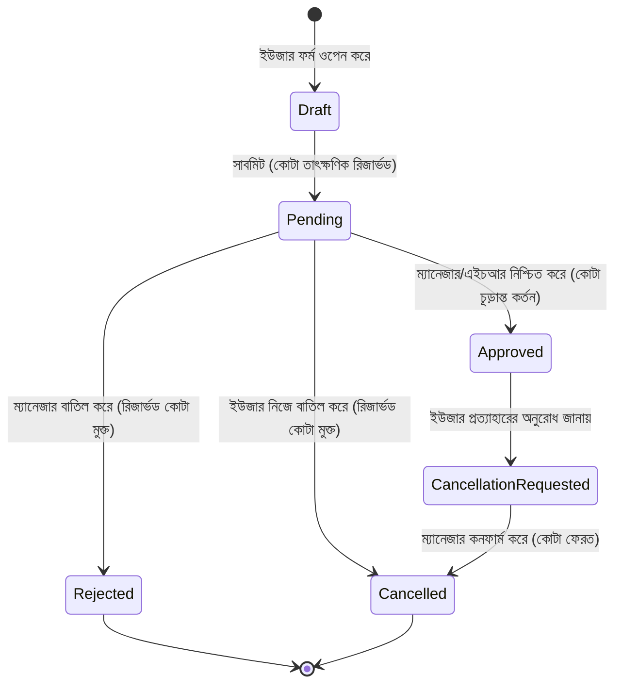

# দক্ষ ছুটি ব্যবস্থাপনার প্রামাণ্য নির্দেশিকা (The Definitive Guide to Expert Leave Management)
### সিস্টেম আর্কিটেকচার, সম্পূর্ণ Edge Case ম্যাট্রিক্স এবং স্ট্র্যাটেজিক প্লেবুক

---

## নির্বাহী সারসংক্ষেপ (Executive Summary)

ছুটি ব্যবস্থাপনা কেবল অনুপস্থিতি ট্র্যাক করার বিষয় নয়; এটি **ব্যবসায়িক ধারাবাহিকতা (Business Continuity)**, **সফটওয়্যার ম্যাথমেটিক্যাল ইন্টিগ্রিটি (Mathematical Integrity)** এবং **পেশাদার জীবনের ভারসাম্য (Work-Life Balance)**-এর একটি অত্যন্ত গুরুত্বপূর্ণ সংযোগস্থল।

পেশাদার পরিবেশে অপরিকল্পিত ছুটি ব্যবস্থাপনার ফলে যেসব জটিলতা সৃষ্টি হয়:
1. **সিস্টেম ত্রুটি (System Faults)**: ডুপ্লিকেট বুকিং, নেগেটিভ ব্যালেন্সের অসঙ্গতি, ভুল কর্মদিবস (Working Day) গণনা এবং অ্যাপ্রুভাল প্রক্রিয়ার সময় রেস কন্ডিশন (Race Conditions)।
2. **অপারেশনাল বিশৃঙ্খলা (Operational Chaos)**: সঠিক হ্যান্ডওভারের অভাবে গুরুত্বপূর্ণ টাস্ক আটকে থাকা, হঠাৎ অনুপস্থিতিতে টিমের ওপর অতিরিক্ত কাজের চাপ এবং প্রাতিষ্ঠানিক কমপ্লায়েন্স লঙ্ঘন।

এই ডকুমেন্টটি একটি **মাস্টার রেফারেন্স ম্যানুয়াল** হিসেবে কাজ করবে:
- **সফটওয়্যার ইঞ্জিনিয়ার ও আর্কিটেক্টদের জন্য**: একটি ত্রুটিহীন (Zero-defect) লিভ ম্যানেজমেন্ট প্ল্যাটফর্ম তৈরির গাইডলাইন।
- **কর্মচারী ও টিম লিডারদের জন্য**: টিমের কাজে বিঘ্ন না ঘটিয়ে কীভাবে কৌশলগতভাবে ছুটি ব্যবস্থাপনা করে সর্বোচ্চ বিশ্রাম ও রিকভারি পাওয়া যায়।

---

## সূচিপত্র (Table of Contents)
1. [এক্সপার্ট দর্শন: Proactive বনাম Reactive দৃষ্টিভঙ্গি](#১-এক্সপার্ট-দর্শন-proactive-বনাম-reactive-দৃষ্টিভঙ্গি)
2. [সিস্টেম আর্কিটেকচার ও State Machine](#২-সিস্টেম-আর্কিটেকচার-ও-state-machine)
3. [সম্পূর্ণ Edge Case ম্যাট্রিক্স এবং সমাধান কৌশল](#৩-সম্পূর্ণ-edge-case-ম্যাট্রিক্স-এবং-সমাধান-কৌশল)
   - [Edge Case ১: তারিখের সংঘর্ষ ও Overlapping Applications](#edge-case-১-তারিখের-সংঘর্ষ-ও-overlapping-applications)
   - [Edge Case ২: উইকেন্ড ও সরকারি ছুটির সীমানা সংঘর্ষ](#edge-case-২-উইকেন্ড-ও-সরকারি-ছুটির-সীমানা-সংঘর্ষ)
   - [Edge Case ৩: স্যান্ডউইচ রুল (The Sandwich Rule)](#edge-case-৩-স্যান্ডউইচ-রুল-the-sandwich-rule)
   - [Edge Case ৪: বছর পরিবর্তনের সীমানা (Dec 31 – Jan 1 Crossover)](#edge-case-৪-বছর-পরিবর্তনের-সীমানা-dec-31--jan-1-crossover)
   - [Edge Case ৫: কোটা শেষ হওয়া এবং নেগেটিভ ব্যালেন্স (LOP)](#edge-case-৫-কোটা-শেষ-হওয়া-এবং-নেগেটিভ-ব্যালেন্স-lop)
   - [Edge Case ৬: সাব-ডে গ্র্যানুলারিটি (Half-Day Edge Cases)](#edge-case-৬-সাব-ডে-গ্র্যানুলারিটি-half-day-edge-cases)
   - [Edge Case ৭: পেছনের তারিখের আবেদন (Backdated Applications)](#edge-case-৭-পেছনের-তারিখের-আবেদন-backdated-applications)
   - [Edge Case ৮: ছুটি বাতিল ও কোটা পুনরুদ্ধারের লাইফসাইকেল](#edge-case-৮-ছুটি-বাতিল-ও-কোটা-পুনরুদ্ধারের-লাইফসাইকেল)
   - [Edge Case ৯: মাল্টি-ট্যাব ও কনকারেন্ট স্টোরেজ রেস কন্ডিশন](#edge-case-৯-মাল্টি-ট্যাব-ও-কনকারেন্ট-স্টোরেজ-রেস-কন্ডিশন)
4. [গাণিতিক সূত্র ও ক্যালকুলেশন ইঞ্জিন (Mathematical Invariants)](#৪-গাণিতিক-সূত্র-ও-ক্যালকুলেশন-ইঞ্জিন-mathematical-invariants)
5. [স্ট্র্যাটেজিক এমপ্লয়ী প্লেবুক: সর্বোচ্চ ছুটির সদ্ব্যবহার](#৫-স্ট্র্যাটেজিক-এমপ্লয়ী-প্লেবুক-সর্বোচ্চ-ছুটির-সদ্ব্যবহার)
   - [হলিডে ব্রিজিং: ২০২৬ সালে মাত্র ৪-৫ দিনের ছুটিতে টানা ১০-১১ দিনের ভ্যাকেশন](#হলিডে-ব্রিজিং-২০২৬-সালে-মাত্র-৪-৫-দিনের-ছুটিতে-টানা-১০-১১-দিনের-ভ্যাকেশন)
   - [নিখুঁত হ্যান্ডওভার ফ্রেমওয়ার্ক (Ironclad Handover)](#নিখুঁত-হ্যান্ডওভার-ফ্রেমওয়ার্ক-ironclad-handover)
   - [এক্সিকিউটিভ আউট-অফ-অফিস (OOO) প্রোটোকল](#এক্সিকিউটিভ-আউট-অফ-অফিস-ooo-প্রোটোকল)

---

## ১. এক্সপার্ট দর্শন: Proactive বনাম Reactive দৃষ্টিভঙ্গি

| দিকসমূহ | সাধারণ বা অপেশাদার পদ্ধতি (Amateur Approach) | এক্সপার্ট পদ্ধতি (Expert Approach) |
| :--- | :--- | :--- |
| **সময়জ্ঞান (Timing)** | ছুটির ঠিক ১-২ দিন আগে আবেদন করা বা ছুটি কাটিয়ে এসে জানানো। | বছরের সরকারি ছুটির ক্যালেন্ডার দেখে ২-৩ মাস আগেই ছুটির রূপরেখা তৈরি। |
| **সিস্টেম ভ্যালিডেশন** | যেকোনো ইনপুট গ্রহণ করা; ওভারল্যাপিং দিনগুলো মানুষ নিজ দায়িত্বে খোঁজে। | অটোমেটিক প্রি-ভ্যালিডেশন: জিরো ওভারল্যাপিং তারিখ ও নির্ভুল কর্মদিবস হিসাব। |
| **ব্যালেন্স ভিজিবিলিটি** | শুধু অ্যাপ্রুভড ছুটি বাদ দেয়; ফলে পেন্ডিং থাকাকালীন একাধিক অতিরিক্ত আবেদন সম্ভব হয়। | অ্যাটমিক রিজার্ভেশন: `Available = Quota - Approved - Pending`। |
| **হ্যান্ডওভার** | "আমি থাকব না, জরুরি হলে স্ল্যাকে নক দিয়েন।" | নির্দিষ্ট প্রাইমারি/সেকেন্ডারি ব্যাকআপ, বিস্তারিত রানবুক এবং স্পষ্ট গাইডলাইন। |
| **ছুটি নেওয়ার কৌশল** | কোনো পরিকল্পনা ছাড়া বিচ্ছিন্নভাবে সোম বা বৃহস্পতিবার ছুটি নেওয়া। | সরকারি ছুটি ও উইকেন্ডের সাথে মিলিয়ে ৫ থেকে ১১ দিনের লম্বা রিকভারি স্প্রিন্ট নেওয়া। |

---

## ২. সিস্টেম আর্কিটেকচার ও State Machine

একটি সুদৃঢ় লিভ ম্যানেজমেন্ট সিস্টেম প্রতিটি ছুটির আবেদনকে একটি অপরিবর্তনীয় আর্থিক লেনদেন (Financial Transaction)-এর মতো বিবেচনা করে, যেখানে ছুটির দিনগুলোই হলো কারেন্সি।



### মূল অপরিবর্তনীয় নিয়মসমূহ (Core Invariant Rules):
1. **Atomic Reservation**: ছুটির আবেদনটি যখন `Pending` অবস্থায় থাকবে, তখন সেই দিনগুলো অবশ্যই `Available` ব্যালেন্স থেকে বিয়োগ হতে হবে। অন্যথায় একজন কর্মী ১০ দিনের কোটার বিপরীতে একই সাথে তিনটি ১০ দিনের আবেদন পাঠাতে পারবে।
2. **Quota Immutability**: বছরের মাঝামাঝি অ্যাডমিন যদি বাৎসরিক কোটায় কোনো পরিবর্তন আনেন, তবে অতীতের সম্পন্ন হওয়া অ্যাপ্রুভড ছুটির তথ্যে কোনো পরিবর্তন আনা যাবে না।
3. **Audit Trail**: প্রতিটি স্টেট পরিবর্তনের (`Pending -> Approved`, `Approved -> Cancelled`) টাইমস্ট্যাম্প, পরিবর্তনকারী ব্যক্তি এবং কারণ সিস্টেমে সংরক্ষিত থাকতে হবে।

---

## ৩. সম্পূর্ণ Edge Case ম্যাট্রিক্স এবং সমাধান কৌশল

### Edge Case ১: তারিখের সংঘর্ষ ও Overlapping Applications

#### সমস্যা:
একজন কর্মীর ইতিমধ্যে `2026-10-12` থেকে `2026-10-15` পর্যন্ত ছুটি অনুমোদিত বা পেন্ডিং আছে। তিনি ভুলবশত বা ইচ্ছাকৃতভাবে `2026-10-14` থেকে `2026-10-18` তারিখের আরেকটি আবেদন পাঠালেন।

#### সমাধানের নিয়মাবলী:
1. **নিয়ম**: যেকোনো একক কর্মদিবসে কার্যকর ছুটির মোট পরিমাণ কখনোই $১.০$ দিনের বেশি হতে পারবে না।
2. **সাব-ডে কনফ্লিক্ট রেজোলিউশন টেবিল (Sub-Day Granularity)**:
   | তারিখ $D$-তে বিদ্যমান রেকর্ড | নতুন আবেদনের ধরন | অনুমোদনযোগ্য? | সিস্টেমের প্রতিক্রিয়া |
   | :--- | :--- | :--- | :--- |
   | Full Day (`Approved` / `Pending`) | Full Day | ❌ **ব্লক** | `"এই তারিখে আপনার ইতিমধ্যে একটি ছুটির আবেদন বিদ্যমান।"` |
   | Full Day (`Approved` / `Pending`) | Half Day (যেকোনো) | ❌ **ব্লক** | `"এই তারিখে ইতিমধ্যে পুরো দিনের ছুটি সংরক্ষিত রয়েছে।"` |
   | Half Day (`First Half`) | Half Day (`First Half`) | ❌ **ব্লক** | `"সকালের হাফ-ডে ইতিমধ্যে বুক করা রয়েছে।"` |
   | Half Day (`First Half`) | Half Day (`Second Half`)| ✅ **অনুমোদিত** | কমপ্লিমেন্টারি বুকিং এলাউ করবে (মোট = ১.০ দিন)। |
   | যেকোনো | `Rejected` / `Cancelled` | ✅ **অনুমোদিত** | পূর্বের বাতিল হওয়া আবেদন তারিখ লক করে না। |

---

### Edge Case ২: উইকেন্ড ও সরকারি ছুটির সীমানা সংঘর্ষ

#### সমস্যা:
একজন কর্মী `2026-03-25` থেকে `2026-03-28` পর্যন্ত তারিখ নির্বাচন করলেন। বাংলাদেশে `2026-03-26` হলো স্বাধীনতা দিবস (সরকারি ছুটি), এবং `2026-03-27` থেকে `2026-03-28` হলো শুক্র-শনিবার (সাপ্তাহিক ছুটি)।

#### সমাধানের নিয়মাবলী:
- সিস্টেম আবেদনের তারিখের রেঞ্জটিকে পৃথক পৃথক দিনে $[D_1, D_2, \dots, D_n]$ বিভক্ত করবে।
- প্রতিটি তারিখের জন্য:
  $$\text{IsWorkingDay}(D_i) = \neg\text{IsWeekend}(D_i) \land \neg\text{IsPublicHoliday}(D_i)$$
- এই উদাহরণে:
  - `2026-03-25` (বুধবার): কর্মদিবস $\rightarrow ১.০$ দিন।
  - `2026-03-26` (বৃহস্পতিবার): স্বাধীনতা দিবস $\rightarrow ০.০$ দিন।
  - `2026-03-27` (শুক্রবার): সাপ্তাহিক ছুটি $\rightarrow ০.০$ দিন।
  - `2026-03-28` (শনিবার): সাপ্তাহিক ছুটি $\rightarrow ০.০$ দিন।
  - **মোট কোটা কর্তন**: $১.০$ দিন (৪ দিন নয়)।
- **এজ গার্ড**: যদি নির্বাচিত রেঞ্জে $\sum \text{WorkingDays} == 0$ হয়, তবে সাবমিশন আটকে দিয়ে নোটিশ দেবে:  
  `"নির্বাচিত দিনগুলো সম্পূর্ণভাবে সাপ্তাহিক ও সরকারি ছুটির মধ্যে পড়েছে। কোনো কোটা কর্তনের প্রয়োজন নেই।"`

---

### Edge Case ৩: স্যান্ডউইচ রুল (The Sandwich Rule)

#### স্যান্ডউইচ রুল কী?
কিছু প্রতিষ্ঠানে বা বিশেষ ছুটির ক্ষেত্রে (বিশেষত ক্যাজুয়াল লিভ বা আনপেইড লিভ), যদি কোনো কর্মী সাপ্তাহিক বা সরকারি ছুটির **ঠিক আগের কর্মদিবস** এবং **ঠিক পরের কর্মদিবসে** ছুটি নেন, তবে মাঝখানের ছুটির দিনগুলোও ছুটি হিসেবে গণ্য করে মোট কোটা থেকে কাটা হয়।

#### উদাহরণ:
- বৃহস্পতিবার: ছুটি
- শুক্র ও শনিবার: সাপ্তাহিক ছুটি
- রবিবার: ছুটি
- **স্যান্ডউইচ রুল ছাড়া**: $১ + ১ = ২$ দিন কর্তন।
- **স্যান্ডউইচ রুলসহ**: $১ + ২ + ১ = ৪$ দিন কর্তন।

#### আর্কিটেকচারাল সুপারিশ:
1. **কনফিগারেশন সুবিধা**: স্যান্ডউইচ রুল লিভ টাইপ অনুযায়ী কনফিগার করার ব্যবস্থা রাখা (যেমন: ক্যাজুয়াল লিভের জন্য চালু, কিন্তু অ্যানুয়াল বা মেডিকেল লিভের জন্য বন্ধ)।
2. **স্বচ্ছতা**: ইউজার ইন্টারফেসে হিসাবটি স্পষ্টভাবে ভেঙে দেখানো:
   ```
   মূল কর্মদিবস: ২ দিন
   স্যান্ডউইচ পলিসি দিন (শুক্র, শনি): +২ দিন
   মোট কোটা কর্তন: ৪ দিন
   ```

---

### Edge Case ৪: বছর পরিবর্তনের সীমানা (Dec 31 – Jan 1 Crossover)

#### সমস্যা:
একজন কর্মী শীতকালীন ছুটি নিলেন `2026-12-28` থেকে `2027-01-04` পর্যন্ত। বাৎসরিক কোটা প্রতি বছর ১লা জানুয়ারি রিসেট হয় (কোনো ক্যারি-ফরওয়ার্ড নেই)। এই ছুটি কোন বছরের কোটা থেকে কাটা যাবে?

#### সমাধানের নিয়মাবলী:
1. **অ্যাটমিক পার্টিশনিং (Atomic Partitioning)**:
   ক্যালকুলেশন ইঞ্জিন এই ছুটিকে স্বয়ংক্রিয়ভাবে দুটি ভিন্ন ক্যালেন্ডার বছরে ভাগ করবে:
   - **২০২৬ পার্টিশন**: `2026-12-28` থেকে `2026-12-31` (২০২৬ সালের কোটা থেকে কর্তন)।
   - **২০২৭ পার্টিশন**: `2027-01-01` থেকে `2027-01-04` (২০২৭ সালের কোটা থেকে কর্তন)।
2. **ভ্যালিডেশন**: উভয় বছরের সংশ্লিষ্ট কোটায় পর্যাপ্ত ব্যালেন্স থাকতে হবে।
3. **ডেটাবেজ স্ট্রাকচার**:
   - মাস্টার রেকর্ডে বাৎসরিক বিভাজন সংরক্ষণ করা:
     ```json
     {
       "startDate": "2026-12-28",
       "endDate": "2027-01-04",
       "yearAllocations": {
         "2026": 4,
         "2027": 2
       }
     }
     ```

---

### Edge Case ৫: কোটা শেষ হওয়া এবং নেগেটিভ ব্যালেন্স (LOP)

#### সমস্যা:
একজন কর্মীর ক্যাজুয়াল লিভ অবশিষ্ট আছে $১.৫$ দিন, কিন্তু জরুরি পারিবারিক প্রয়োজনে তিনি আবেদন করলেন $৩$ দিনের জন্য।

#### সমাধানের ম্যাট্রিক্স:
1. **হার্ড ব্লকিং মোড**: সিস্টেম সরাসরি আবেদন আটকে দেবে: `"অপর্যাপ্ত ব্যালেন্স। আপনার কেবল ১.৫ দিন অবশিষ্ট রয়েছে।"`
2. **গ্রেসফুল LOP (Leave Without Pay) ওভারফ্লো মোড (ইন্ডাস্ট্রি স্ট্যান্ডার্ড)**:
   - সিস্টেম আবেদনটি গ্রহণ করবে, কিন্তু কর্তনটিকে বিভক্ত করবে:
     - $১.৫$ দিন $\rightarrow$ ক্যাজুয়াল লিভ থেকে কাটা হবে (ব্যালেন্স হবে $০.০$)।
     - অবশিষ্ট $১.৫$ দিন $\rightarrow$ স্বয়ংক্রিয়ভাবে **Unpaid Leave / LOP** হিসেবে চিহ্নিত হবে।
   - স্বয়ংক্রিয় ইমেইল ড্রাফটে ম্যানেজার ও এইচআরকে অবহিত করা হবে যে অতিরিক্ত দিনগুলো অবৈতনিক হিসেবে বিবেচিত হবে।

---

### Edge Case ৬: সাব-ডে গ্র্যানুলারিটি (Half-Day Edge Cases)

#### বিশেষ পরিস্থিতি:
1. **ফার্স্ট হাফ বনাম সেকেন্ড হাফ**:
   - First Half: সকাল ০৯:০০ – দুপুর ০১:৩০।
   - Second Half: দুপুর ০১:৩০ – সন্ধ্যা ০৬:০০।
2. **ছুটির দিনে হাফ-ডে সিলেক্ট করা**:
   - শুক্রবার বা সরকারি ছুটির দিনে "Half Day" সিলেক্ট করলে কর্তন হবে $০.০$ দিন, $০.৫$ দিন নয়।
3. **একাধিক দিনের রেঞ্জে হাফ-ডে টগল**:
   - তারিখ রেঞ্জ সিলেক্ট করার পর হাফ-ডে অন করলে `endDate` স্বয়ংক্রিয়ভাবে `startDate`-এর সাথে লক হয়ে যাবে (হাফ-ডে কেবল একক দিনের জন্য প্রযোজ্য)।

---

### Edge Case ৭: পেছনের তারিখের আবেদন (Backdated Applications)

#### সমস্যা:
একজন কর্মী সোমবারে হঠাৎ অসুস্থ হয়ে পড়লেন এবং বৃহস্পতিবার অফিসে ফিরে সোম-বুধবারের ছুটির আবেদন করলেন।

#### নিয়মাবলী:
1. **ভ্যালিডেশনসহ অনুমতি**: সিক লিভের ক্ষেত্রে পেছনের তারিখ সমর্থন করতে হবে (টানা ২ দিনের বেশি হলে মেডিকেল সার্টিফিকেট আপলোডের ব্যবস্থা)।
2. **গ্রেস পিরিয়ড**: অতীতের সর্বোচ্চ কত দিন পর্যন্ত আবেদন করা যাবে তার একটি সুনির্দিষ্ট সীমা নির্ধারণ করা (যেমন: সর্বোচ্চ ৭ দিন)।
3. **অতীতের অর্থবছর লক**: পূর্ববর্তী ক্যালেন্ডার বছর ক্লোজ হয়ে যাওয়ার পর সেই বছরে কোনো পেছনের তারিখের আবেদন দেওয়া যাবে না।

---

### Edge Case ৮: ছুটি বাতিল ও কোটা পুনরুদ্ধারের লাইফসাইকেল

#### সমস্যা:
অনুমোদিত কোনো ছুটি পরে বাতিল করা হলো। ব্যালেন্স যদি স্ট্যাটিকভাবে সংরক্ষণ করা হয়, তবে ভুলবশত দিনগুলো হারিয়ে যেতে পারে।

#### নিয়মাবলী:
1. ব্যালেন্স গণনা সবসময় সক্রিয় রেকর্ডগুলোর ওপর নির্ভরশীল একটি **Pure Derivative Function** হতে হবে:
   $$\text{Remaining} = \text{Quota} - \sum_{\text{Approved}} \text{Days} - \sum_{\text{Pending}} \text{Days}$$
2. কোনো রেকর্ড `Cancelled` বা `Rejected` হিসেবে চিহ্নিত হওয়ার সাথে সাথে কোনো ম্যানুয়াল হস্তক্ষেপ ছাড়াই ব্যালেন্স স্বয়ংক্রিয়ভাবে পুনরুদ্ধার হবে।

---

### Edge Case ৯: মাল্টি-ট্যাব ও কনকারেন্ট স্টোরেজ রেস কন্ডিশন

#### সমস্যা:
একজন কর্মী ব্রাউজারে দুটি ট্যাব ওপেন করলেন। শেষ অবশিষ্ট ২ দিনের জন্য ট্যাব ১ থেকে আবেদন সাবমিট করলেন এবং সাথে সাথে ট্যাব ২ থেকেও একই ২ দিনের জন্য আবেদন পাঠালেন।

#### নিয়মাবলী:
1. **Dexie.js IndexedDB Transactions**: প্রতিটি রাইট অপারেশন একটি অ্যাটমিক ট্রানজ্যাকশনের মধ্যে চলতে হবে যা কমিট করার ঠিক পূর্বে বর্তমান কোটা পুনরায় যাচাই করে।
2. **BroadcastChannel লিসেনার**: ট্যাব ১-এ ডেটা পরিবর্তন হলে ব্রাউজার ইভেন্টের মাধ্যমে ট্যাব ২-এর ব্যালেন্স তাৎক্ষণিক রিফ্রেশ হবে।

---

## ৪. গাণিতিক সূত্র ও ক্যালকুলেশন ইঞ্জিন (Mathematical Invariants)

### মূল কর্মদিবস গণনার সূত্র:

$$\text{WorkingDays}(S, E) = \sum_{d=S}^{E} \mathbb{I}\left( \text{DayOfWeek}(d) \notin \text{Weekend} \land d \notin \text{Holidays} \right) \times \text{Weight}(d)$$

যেখানে:
- $\text{Weight}(d) = ০.৫$ (যদি দিনটি হাফ-ডে হয়), অন্যথায় $১.০$।
- $\mathbb{I}(\dots)$ হলো ইন্ডিকেটর ফাংশন (শর্ত সত্য হলে $১$, মিথ্যা হলে $০$)।

### ব্যালেন্স সমীকরণ:
$$\text{AvailableBalance}(Y, T) = \text{TotalQuota}(Y, T) - \sum_{r \in \text{Records}(Y, T, \text{Approved})} \text{Days}(r) - \sum_{r \in \text{Records}(Y, T, \text{Pending})} \text{Days}(r)$$

---

## ৫. স্ট্র্যাটেজিক এমপ্লয়ী প্লেবুক: সর্বোচ্চ ছুটির সদ্ব্যবহার

দক্ষভাবে ছুটি পরিচালনার মূল লক্ষ্য হলো **কাজের গতি ও টিমের আস্থা ১০০% বজায় রেখে নিজের জন্য সর্বোচ্চ মানসিক ও শারীরিক বিশ্রামের সময় বের করা**।

### হলিডে ব্রিজিং: ২০২৬ সালে মাত্র ৪-৫ দিনের ছুটিতে টানা ১০-১১ দিনের ভ্যাকেশন

২০২৬ সালের বাংলাদেশ কর্পোরেট ক্যালেন্ডার (শুক্র-শনিবার উইকেন্ড):

#### কৌশল ১: স্বাধীনতা দিবস আল্ট্রা-স্প্রিন্ট (মার্চ ২০২৬)
- **২৬ মার্চ (বৃহস্পতিবার)**: স্বাধীনতা দিবস (সরকারি ছুটি)।
- **২৭ মার্চ (শুক্রবার)**: সাপ্তাহিক ছুটি।
- **২৮ মার্চ (শনিবার)**: সাপ্তাহিক ছুটি।
- **২৯ মার্চ (রবিবার) থেকে ০২ এপ্রিল (বৃহস্পতিবার)**: ৫ দিনের বাৎসরিক ছুটি (Annual Leave) নিন।
- **০৩ এপ্রিল (শুক্রবার) ও ০৪ এপ্রিল (শনিবার)**: সাপ্তাহিক ছুটি।
- **ফলাফল**: **মাত্র ৫ দিনের ছুটি নিয়ে টানা ১১ দিনের বিশাল ভ্যাকেশন!**

#### কৌশল ২: ঈদুল ফিতর গোল্ডেন ব্রিজ (মার্চ / এপ্রিল ২০২৬)
- ঈদের ছুটির ঠিক আগে বা পরে মাত্র ১-২ দিনের ব্রিজ লিভ নিলে যাতায়াতের ট্রাফিক জ্যাম এড়ানো যায় এবং টানা ৮ থেকে ৯ দিনের স্বস্তিদায়ক ছুটি পাওয়া যায়।

---

### নিখুঁত হ্যান্ডওভার ফ্রেমওয়ার্ক (Ironclad Handover)

ছুটিতে যাওয়ার আগে ম্যানেজার ও টিমকে অন্ধকারে রাখা যাবে না। একটি আদর্শ ছুটির আবেদন সবসময় ৩টি প্রশ্নের স্পষ্ট উত্তর দেয়:

1. **আমার অনুপস্থিতিতে কে দায়িত্ব পালন করছে?** (নির্দিষ্ট ও দায়িত্বপ্রাপ্ত ব্যাকআপ ব্যক্তি)।
2. **কোন কাজগুলো সম্পন্ন এবং কোনগুলো স্থগিত রাখা হয়েছে?** (চলমান কাজের স্পষ্ট তালিকা)।
3. **কোন পরিস্থিতিকে জরুরি বলে গণ্য করা হবে?** (কোন পরিস্থিতিতে ফোন দেওয়া যাবে এবং কোনগুলো ফিরে আসা পর্যন্ত অপেক্ষা করতে হবে)।

#### হ্যান্ডওভারের সাধারণ রূপরেখা:
```markdown
### প্রোজেক্ট হ্যান্ডওভার সামারি
- প্রাইমারি ব্যাকআপ: [সহকর্মীর নাম] ([ইমেইল / স্ল্যাক])
- চলমান পুল রিকুয়েস্ট (PRs): মার্জ করে স্টেজিংয়ে টেস্ট করা হয়েছে।
- ক্লায়েন্ট কমিউনিকেশন: মঙ্গলবারের মিটিংয়ে [সহকর্মীর নাম] আপডেট দেবেন।
- ইমার্জেন্সি এসকেলেশন: কেবল P1 প্রোডাকশন ডাউন হলে মোবাইলে ফোন করা যাবে।
```

---

### এক্সিকিউটিভ আউট-অফ-অফিস (OOO) প্রোটোকল

#### ইন্টারনাল স্ল্যাক / মাইক্রোসফট টিমস স্ট্যাটাস:
> 🌴 `OOO: Mar 26 - Apr 05 | Backup: @Rahim for Project Alpha | Emergency: Call mobile`

#### ক্লায়েন্টদের জন্য প্রফেশনাল অটো-রেসপন্ডার:
```text
Subject: Out of Office: [আপনার নাম] until April 5, 2026

Hello,

Thank you for reaching out. I am currently out of the office on scheduled leave, returning on Monday, April 6, 2026.

During this period, I will have no access to email. 

For urgent matters regarding:
- Project Alpha: Please contact Rahim ([email@company.com])
- General Inquiries: Please contact HR/Support ([support@company.com])

Otherwise, I will respond to your message promptly upon my return.

Best regards,
[আপনার নাম]
[আপনার পদবি]
```

---

## উপসংহার

একটি দক্ষ ছুটি ব্যবস্থাপনা ব্যবস্থার মূল ভিত্তি হলো:
1. **গাণিতিক নির্ভুলতা (Mathematical Rigor)**: যা ডেটার অসঙ্গতি ও কোটা সংক্রান্ত হিসাবের গরমিল দূর করে।
2. **সহজ ও আধুনিক UI**: যা রিয়েল-টাইম নোটিফিকেশন ও স্মার্ট কনফ্লিক্ট ডিটেকশনের মাধ্যমে ভুল আবেদন প্রতিরোধ করে।
3. **পেশাদার নিয়মানুবর্তিতা (Professional Etiquette)**: যা টিমের বোঝাপড়া ও কাজের গতি বজায় রাখে।
