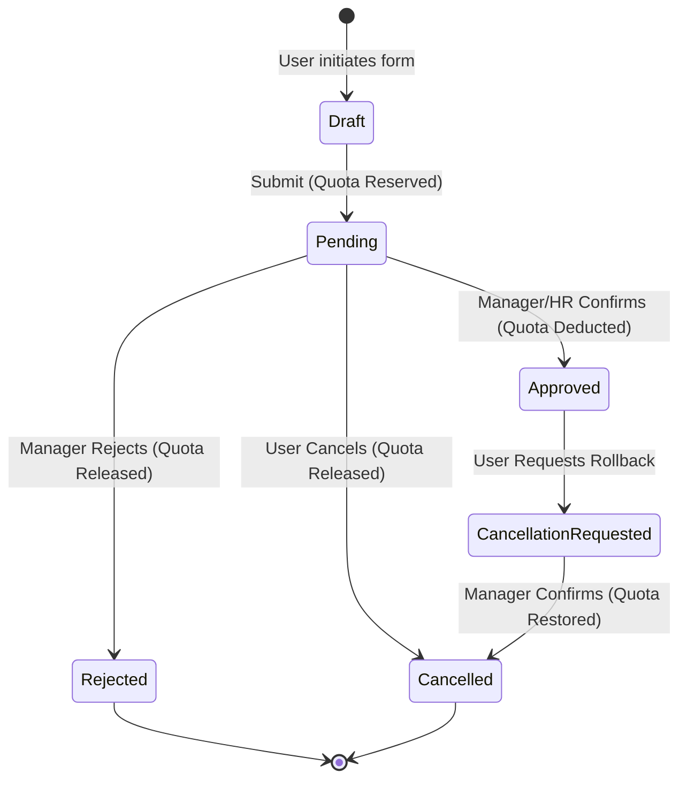

# The Definitive Guide to Expert Leave Management
### System Architecture, Complete Edge Case Matrix, and Strategic Playbook

---

## Executive Summary

Managing leave is not merely about tracking absence; it is a critical intersection of **business continuity**, **software mathematical integrity**, and **professional work-life balance**. 

In professional environments, poor leave management leads to:
1. **System Faults**: Duplicate bookings, negative balance anomalies, incorrect working day calculations, and race conditions during approval.
2. **Operational Chaos**: Critical tasks stalled due to missing handovers, team burn-out from unannounced absences, and compliance violations.

This document serves as the **master reference manual** for:
- **Software Engineers & Architects**: Designing zero-defect leave management platforms.
- **Employees & Leaders**: Managing personal leaves strategically to maximize time off without impacting team velocity.

---

## Table of Contents
1. [The Expert Philosophy: Proactive vs. Reactive](#1-the-expert-philosophy-proactive-vs-reactive)
2. [System Architecture & State Machine](#2-system-architecture--state-machine)
3. [The Complete Edge Case Matrix & Handling Strategies](#3-the-complete-edge-case-matrix--handling-strategies)
   - [Edge Case 1: Date Collisions & Overlapping Applications](#edge-case-1-date-collisions--overlapping-applications)
   - [Edge Case 2: Weekend & Holiday Boundary Collisions](#edge-case-2-weekend--holiday-boundary-collisions)
   - [Edge Case 3: The Sandwich Rule](#edge-case-3-the-sandwich-rule)
   - [Edge Case 4: Cross-Year Boundary (Dec 31 – Jan 1 Crossover)](#edge-case-4-cross-year-boundary-dec-31--jan-1-crossover)
   - [Edge Case 5: Quota Exhaustion & Negative Balances (LOP)](#edge-case-5-quota-exhaustion--negative-balances-lop)
   - [Edge Case 6: Sub-Day Granularity (Half-Day Edge Cases)](#edge-case-6-sub-day-granularity-half-day-edge-cases)
   - [Edge Case 7: Backdated Applications & Retroactive Approvals](#edge-case-7-backdated-applications--retroactive-approvals)
   - [Edge Case 8: Cancellation & Quota Restoration Lifecycle](#edge-case-8-cancellation--quota-restoration-lifecycle)
   - [Edge Case 9: Multi-Tab & Concurrent Storage Race Conditions](#edge-case-9-multi-tab--concurrent-storage-race-conditions)
4. [Mathematical Invariants & Calculation Engine](#4-mathematical-invariants--calculation-engine)
5. [The Strategic Employee Playbook: Maximizing Time Off](#5-the-strategic-employee-playbook-maximizing-time-off)
   - [Holiday Bridging: Turning 4 Days into 10 Days in 2026](#holiday-bridging-turning-4-days-into-10-days-in-2026)
   - [The Ironclad Handover Framework](#the-ironclad-handover-framework)
   - [Executive Out-Of-Office (OOO) Protocols](#executive-out-of-office-ooo-protocols)

---

## 1. The Expert Philosophy: Proactive vs. Reactive

| Aspect | The Novice / Amateur Approach | The Expert Approach |
| :--- | :--- | :--- |
| **Timing** | Applies 1-2 days before planned absence or post-facto. | Plans annual holidays around calendar gaps 2-3 months ahead. |
| **System Validation** | Accepts any input string; lets humans figure out overlapping days. | Atomic pre-validation: zero overlapping dates, deterministic working days. |
| **Balance Visibility** | Only subtracts approved leaves; allows pending leaves to over-allocate. | Atomic reservation: `Available = Quota - Approved - Pending`. |
| **Handover** | "I won't be available, check Slack if urgent." | Designated primary/secondary backup, documented runbook, zero escalation. |
| **Holidays** | Ignores calendar bridging; takes random Mondays or Thursdays. | Bridges 1-2 leave days with official weekends for 5 to 9-day deep recovery sprints. |

---

## 2. System Architecture & State Machine

A robust leave management system treats every leave request as an immutable financial transaction where days are the currency.



### Core Invariant Rules:
1. **Atomic Reservation**: When a leave request is in `Pending` state, those days MUST be deducted from the `Available` balance. If not, an employee can submit three concurrent 10-day requests against a 10-day quota.
2. **Quota Immutability**: Historical approved leaves must never change retroactively if an administrator alters annual quotas later in the year.
3. **Audit Trail**: Every state transition (`Pending -> Approved`, `Approved -> Cancelled`) must record timestamp, actor, and reason.

---

## 3. The Complete Edge Case Matrix & Handling Strategies

### Edge Case 1: Date Collisions & Overlapping Applications

#### The Problem:
An employee has an existing approved or pending leave from `2026-10-12` to `2026-10-15`. They accidentally or intentionally submit another request from `2026-10-14` to `2026-10-18`.

#### Resolution Protocol:
1. **Rule**: No working day may have $> 1.0$ total allocated leave days across non-rejected records.
2. **Sub-Day Collision Resolution Table**:
   | Existing Record on Date $D$ | New Request on Date $D$ | Permitted? | System Response |
   | :--- | :--- | :--- | :--- |
   | Full Day (`Approved` / `Pending`) | Full Day | ❌ **Block** | `"You already have a leave request covering this date."` |
   | Full Day (`Approved` / `Pending`) | Half Day (Any) | ❌ **Block** | `"A full-day leave already exists for this date."` |
   | Half Day (`First Half`) | Half Day (`First Half`) | ❌ **Block** | `"Morning half-day is already booked for this date."` |
   | Half Day (`First Half`) | Half Day (`Second Half`)| ✅ **Allow** | Permit complementary booking (total = 1.0 day). |
   | Any | `Rejected` / `Cancelled` | ✅ **Allow** | Prior cancelled requests release date locks. |

---

### Edge Case 2: Weekend & Holiday Boundary Collisions

#### The Problem:
An employee selects `2026-03-25` to `2026-03-28`. In Bangladesh, `2026-03-26` is Independence Day (Public Holiday), and `2026-03-27` to `2026-03-28` are Friday/Saturday (Weekend).

#### Resolution Protocol:
- The system must decompose the requested range into discrete dates $[D_1, D_2, \dots, D_n]$.
- For each date $D_i$:
  $$\text{IsWorkingDay}(D_i) = \neg\text{IsWeekend}(D_i) \land \neg\text{IsPublicHoliday}(D_i)$$
- In this example:
  - `2026-03-25` (Wed): Working day $\rightarrow 1.0$ day.
  - `2026-03-26` (Thu): Independence Day $\rightarrow 0.0$ day.
  - `2026-03-27` (Fri): Weekend $\rightarrow 0.0$ day.
  - `2026-03-28` (Sat): Weekend $\rightarrow 0.0$ day.
  - **Total Deduction**: $1.0$ day (Not 4 days).
- **Edge Guard**: If $\sum \text{WorkingDays} == 0$, the system must block submission with:  
  `"Selected dates fall entirely on non-working days. No leave deduction is required."`

---

### Edge Case 3: The Sandwich Rule

#### What is the Sandwich Rule?
In certain organizations or specific leave types (frequently Casual Leave or unpaid leaves), if an employee takes leave on the working day **immediately preceding** and **immediately following** a weekend or public holiday, the intervening weekend/holiday days are also treated as leave and deducted from the quota.

#### Example:
- Thursday: Leave
- Friday & Saturday: Weekend
- Sunday: Leave
- **Without Sandwich Rule**: $1 + 1 = 2$ days deducted.
- **With Sandwich Rule**: $1 + 2 + 1 = 4$ days deducted.

#### Architectural Recommendation:
1. **Configurability**: Make the sandwich rule configurable per leave type (e.g., enable for Casual Leave, disable for Annual / Sick Leave).
2. **Transparency**: The UI calculation breakdown must explicitly show:
   ```
   Working Days: 2
   Sandwich Policy Days (Fri, Sat): +2
   Total Leave Deducted: 4 days
   ```

---

### Edge Case 4: Cross-Year Boundary (Dec 31 – Jan 1 Crossover)

#### The Problem:
An employee books a winter holiday from `2026-12-28` to `2027-01-04`. Annual leave quotas reset on January 1st every year (no carry forward). Which year's quota is deducted?

#### Resolution Protocol:
1. **Atomic Partitioning**:
   The calculation engine must split the leave request into two distinct date partitions:
   - **Partition 2026**: `2026-12-28` to `2026-12-31` (Deducted from 2026 quota).
   - **Partition 2027**: `2027-01-01` to `2027-01-04` (Deducted from 2027 quota).
2. **Validation**: Both partitions must have sufficient quota in their respective calendar years.
3. **Database Representation**:
   - Option A: Automatically create two linked sub-records.
   - Option B: Maintain one master record with a partition breakdown array:
     ```json
     {
       "startDate": "2026-12-28",
       "endDate": "2027-01-04",
       "yearAllocations": {
         "2026": 4,
         "2027": 2
       }
     }
     ```

---

### Edge Case 5: Quota Exhaustion & Negative Balances (LOP)

#### The Problem:
An employee has $1.5$ days of Casual Leave remaining, but applies for $3$ days due to a family emergency.

#### Resolution Matrix:
1. **Hard Blocking Mode**: System rejects submission: `"Insufficient balance. You only have 1.5 days available."`
2. **Graceful LOP (Leave Without Pay) Overflow Mode (Industry Best Practice)**:
   - System permits submission, but partitions the deduction:
     - $1.5$ days $\rightarrow$ Deducted from Casual Leave (Balance drops to $0.0$).
     - $1.5$ days $\rightarrow$ Automatically classified as **Unpaid Leave / LOP**.
   - Notifies HR and Manager in the generated email draft regarding the unpaid portion.

---

### Edge Case 6: Sub-Day Granularity (Half-Day Edge Cases)

#### Edge Scenarios:
1. **First Half vs Second Half**:
   - First Half typically covers: 09:00 AM – 01:30 PM.
   - Second Half typically covers: 01:30 PM – 06:00 PM.
2. **Half-Day on Non-Working Days**:
   - If a user toggles "Half Day" on a Friday or holiday, the calculated deduction must be $0.0$ days, not $0.5$.
3. **Multi-Day Range with Half-Day**:
   - If a range is selected (`2026-05-10` to `2026-05-12`), a single boolean `isHalfDay` creates ambiguity.
   - **Rule**: If `isHalfDay` is enabled, `endDate` must strictly lock to `startDate` (a half-day can only apply to a single calendar date).

---

### Edge Case 7: Backdated Applications & Retroactive Approvals

#### The Problem:
An employee falls sick on Monday, returns on Thursday, and applies for Monday–Wednesday retroactively.

#### Rules:
1. **Permit with Validation**: Sick leaves must support backdating (with optional medical attachment if $> 2$ consecutive days).
2. **Grace Period**: Configure a maximum retroactive window (e.g., maximum 7 days in the past).
3. **Past Year Lock**: An employee cannot apply for leave in a past calendar year once that financial/calendar year has been closed.

---

### Edge Case 8: Cancellation & Quota Restoration Lifecycle

#### The Problem:
An approved leave is cancelled after the fact. If balances are pre-calculated statically, the days may be permanently lost.

#### Rules:
1. Balance calculation must be a **pure derivative function** of the active records:
   $$\text{Remaining} = \text{Quota} - \sum_{\text{Approved}} \text{Days} - \sum_{\text{Pending}} \text{Days}$$
2. Marking a record as `Cancelled` or `Rejected` immediately restores the balance without manual credit adjustments.

---

### Edge Case 9: Multi-Tab & Concurrent Storage Race Conditions

#### The Problem:
An employee opens two browser tabs. Tab A submits an application for the last 2 available days. Tab B simultaneously submits another request for the same 2 days.

#### Rules:
1. **Dexie.js IndexedDB Transactions**: Every write operation (`leaves.add`) must execute inside an atomic IndexedDB transaction checking current remaining quota before commit.
2. **BroadcastChannel / Storage Listener**: When Tab A commits a change, post a broadcast message so Tab B refreshes its balances without requiring a page reload.

---

## 4. Mathematical Invariants & Calculation Engine

### Master Formulas:

$$\text{WorkingDays}(S, E) = \sum_{d=S}^{E} \mathbb{I}\left( \text{DayOfWeek}(d) \notin \text{Weekend} \land d \notin \text{Holidays} \right) \times \text{Weight}(d)$$

Where:
- $\text{Weight}(d) = 0.5$ if $d$ is a valid Half-Day, else $1.0$.
- $\mathbb{I}(\dots)$ is the indicator function ($1$ if true, $0$ if false).

### Balance Equation:
$$\text{AvailableBalance}(Y, T) = \text{TotalQuota}(Y, T) - \sum_{r \in \text{Records}(Y, T, \text{Approved})} \text{Days}(r) - \sum_{r \in \text{Records}(Y, T, \text{Pending})} \text{Days}(r)$$

---

## 5. The Strategic Employee Playbook: Maximizing Time Off

Leave management like an expert means **maximizing restoration time while maintaining 100% workplace trust and zero friction**.

### Holiday Bridging: Turning 4 Days into 10 Days in 2026

In 2026 Bangladesh corporate calendars (Friday & Saturday weekend):

#### Strategy 1: The Independence Day Ultra-Sprint (March 2026)
- **March 26 (Thursday)**: Independence Day (Official Holiday).
- **March 27 (Friday)**: Weekend.
- **March 28 (Saturday)**: Weekend.
- **March 29 (Sunday) to April 2 (Thursday)**: Take 5 days of Annual Leave.
- **April 3 (Friday) & April 4 (Saturday)**: Weekend.
- **Result**: **5 days of leave taken $\rightarrow$ 11 consecutive days of vacation!**

#### Strategy 2: The Eid-ul-Fitr Extender (March / April 2026)
- Eid holidays often fall adjacent to weekends. Taking just 1 bridge day (e.g. Wednesday before Eid or Sunday after Eid) doubles consecutive time off from 4 days to 9 days.

---

### The Ironclad Handover Framework

Never leave your team guessing. An expert leave application always answers the 3 critical managerial questions before they are asked:

1. **Who is holding the fort?** (Designated, informed backup person).
2. **What is parked vs. active?** (Clear priority status of active deliverables).
3. **What is an emergency?** (Explicit definition of what justifies a phone call vs. what waits for your return).

#### Standard Handover Matrix:
```markdown
### Project Handover Summary
- Primary Backup: [Colleague Name] ([Email / Slack])
- In-Flight Pull Requests: Merged and deployed to staging.
- Client Communications: [Colleague Name] briefed to attend Tuesday sync.
- Emergency Escalation: Call mobile only for P1 production outages.
```

---

### Executive Out-Of-Office (OOO) Protocols

#### Internal Slack / Teams Status:
> 🌴 `OOO: Mar 26 - Apr 05 | Backup: @Rahim for Project Alpha | Emergency: Call mobile`

#### External Client Email Auto-Responder:
```text
Subject: Out of Office: [Your Name] until April 5, 2026

Hello,

Thank you for reaching out. I am currently out of the office on scheduled leave, returning on Monday, April 6, 2026.

During this period, I will have no access to email. 

For urgent matters regarding:
- Project Alpha: Please contact Rahim ([email@company.com])
- General Inquiries: Please contact HR/Support ([support@company.com])

Otherwise, I will respond to your message promptly upon my return.

Best regards,
[Your Name]
[Your Title]
```

---

## Conclusion

An expert leave management system combines:
1. **Mathematical rigor** that prevents data corruption and quota leakage.
2. **Frictionless UI** with real-time feedback and smart collision detection.
3. **Professional etiquette** that keeps teams aligned and projects uninterrupted.
